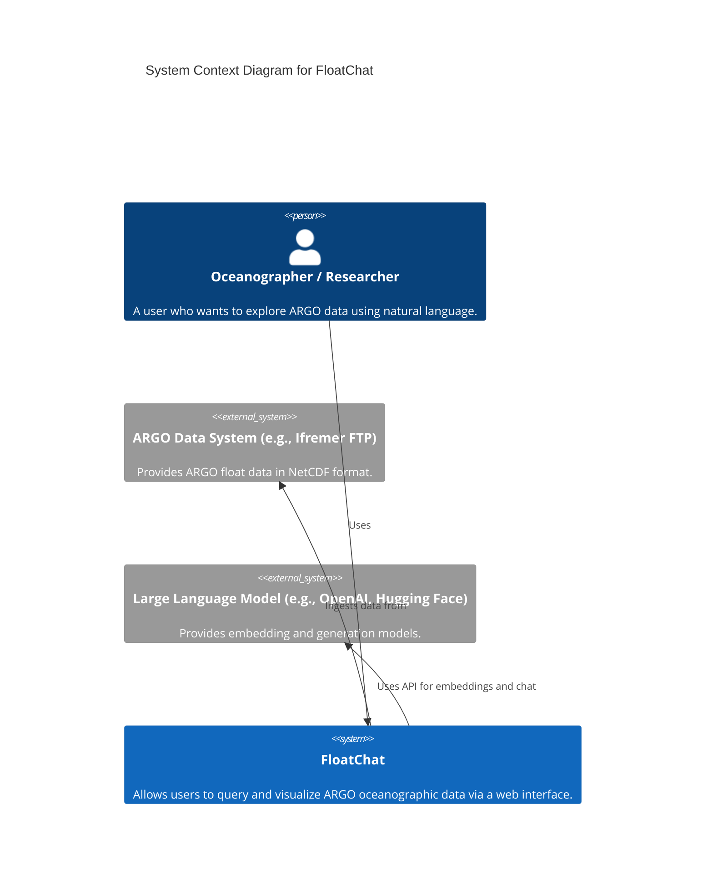
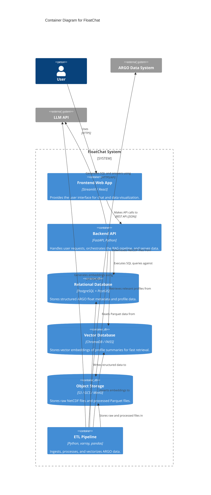
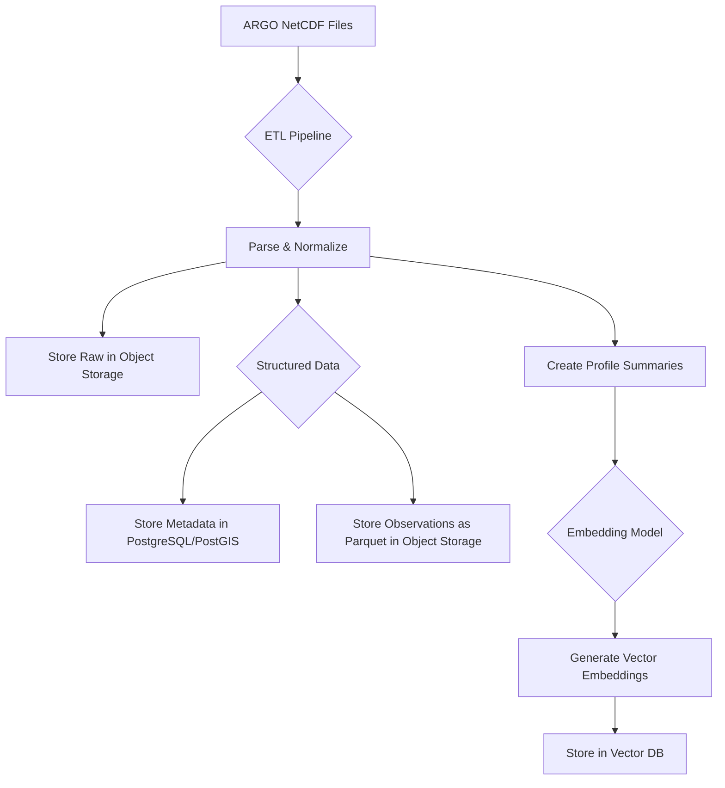
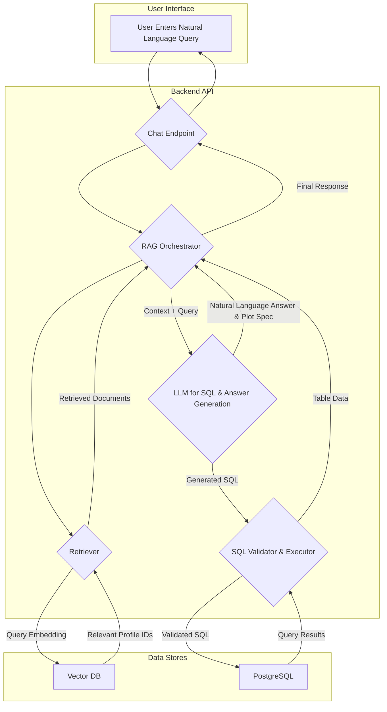

# FloatChat Architecture

This document provides a detailed overview of the FloatChat system architecture, including the data flow, component interactions, and infrastructure.

## C4 Model Diagrams

We use the C4 model to describe the architecture at different levels of detail.

### Level 1: System Context Diagram

This diagram shows how the FloatChat system fits into its environment and interacts with users and external systems.

### Level 2: Container Diagram

This diagram zooms into the FloatChat system to show its major containers (applications, services, databases).

## Data Flow and RAG Pipeline

This diagram illustrates the flow of data from ingestion to user query.

### 1. Data Ingestion Flow

### 2. RAG Query Flow

## Infrastructure and Deployment

The application is designed to be deployed on the cloud using modern infrastructure practices.

*   **Containerization:** All services are containerized using Docker.
*   **Local Development:** A `docker-compose.yml` file is provided for easy local setup.
*   **Cloud Provisioning:** Terraform scripts are used to provision the necessary cloud resources (VPC, Kubernetes cluster, managed databases, object storage).
*   **Orchestration:** Kubernetes is used for container orchestration, managing deployments, services, and scaling.
*   **CI/CD:** GitHub Actions are used to automate the build, test, and deployment process.
